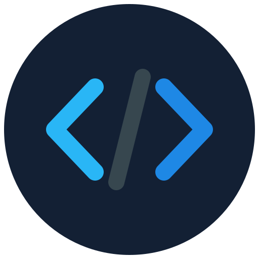

<div align="center">
  
  <h1>DashIDE 🚀</h1>
</div>

DashIDE is a fully functional, self-contained mobile IDE built with Flutter. It is designed to let you write code, manage version control, and compile cross-platform applications directly from your tablet or phone without needing a local toolchain.

## ✨ Features

* **Advanced Code Editor:** Multi-tab support, syntax highlighting (Atom One Dark, Dracula, Monokai, etc.), code formatting, intelligent autocomplete suggestions, and quick-insert snippet toolbars.
* **Workspace Explorer:** Full file tree management with the ability to create, delete, and navigate directories and files seamlessly.
* **Git Source Control:** 
  * Real-time "dirty" file tracking with visual `M` (Modified) badges.
  * Direct integration with GitHub's Git API for atomic, multi-file commits.
  * Target repository switcher (auto-provisions missing repositories on the fly).
* **Cloud CI/CD Compilation:** Bypasses mobile OS restrictions by dispatching builds to GitHub Actions. Supports compiling Android (ARM64 & ARMv7 APKs), Linux, Windows, and macOS desktops.
* **Sandbox Preview Canvas:** A built-in staging view to verify your active editor state before dispatching the payload to the cloud compiler.
* **Remote SSH Terminal:** An integrated, persistent `dartssh2` terminal dock to connect to remote Linux servers directly from the IDE.

## ⚠️ Known Issues & Limitations

As DashIDE is actively evolving, there are a few known quirks to keep in mind:

* **Workspace Initialization Glitch:** Occasionally, upon first creating a workspace, the `pubspec.yaml` file may fail to generate correctly or accidentally save Dart code inside it. If this happens, simply paste the [Starter Pubspec](#-starter-pubspecyaml) provided below to fix the CI build.
* **Live Preview is Static:** True local UI interpretation via `flutter_eval` has been disabled because it lacks compatibility with modern Flutter SDKs (like missing `isAntiAlias` implementations). The preview tab currently functions as a static Sandbox Canvas.
* **Empty Default Repository:** The target GitHub repository defaults to an empty string to prevent unauthorized access errors. You **must** tap the ⇄ icon in the Source Control panel to set your destination repo before making your first commit.

## 🛠️ Setup & Usage

1. Open **DashIDE**.
2. Tap the **Build** (Rocket) icon or navigate to the Settings dial.
3. Enter a **GitHub Personal Access Token (PAT)** with `repo` and `workflow` scopes.
4. Specify your target repository (e.g., `YourUsername/DashIDE`).
5. Write your code, hit **Commit & Push**, and dispatch a build to compile your app in the cloud!

## 📦 Starter pubspec.yaml

If your workspace fails to generate a valid configuration, paste this into your `pubspec.yaml` file to allow the cloud compiler to run correctly:

```yaml
name: demo_app
description: A new Flutter project built in DashIDE.
publish_to: 'none'
version: 1.0.0+1

environment:
  sdk: '>=3.0.0 <4.0.0'

dependencies:
  flutter:
    sdk: flutter
  cupertino_icons: ^1.0.2

dev_dependencies:
  flutter_test:
    sdk: flutter
  flutter_lints: ^2.0.0

flutter:
  uses-material-design: true
```

## 📜 License

This project is licensed under the GNU General Public License v3.0 (GPLv3). See the LICENSE file for full details.
